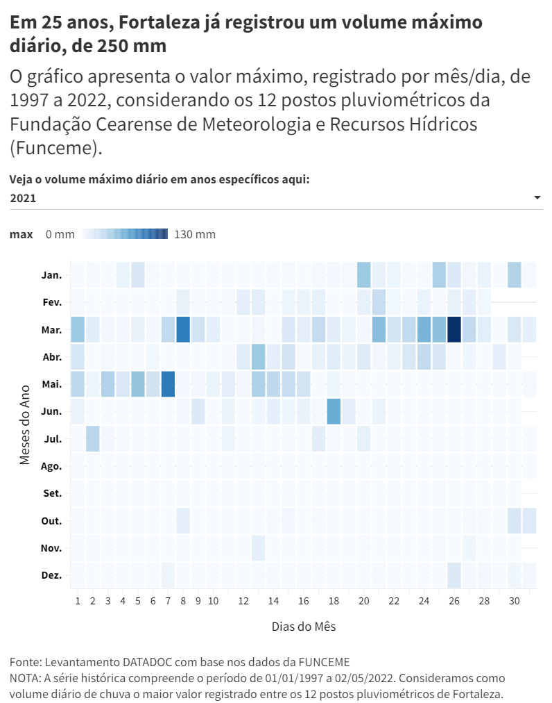

# Grandes chuvas em Fortaleza: impactos e aprendizados futuros

Há 25 anos, no dia 24 de abril de 1997, Fortaleza enfrentou a maior chuva do século XX. Naquele dia foi registrada uma precipitação de 270,6 milímetros (mm) entre as 3 horas da madrugada e as 13 horas. Em um só dia, 403 pessoas ficaram desabrigadas, 2.830 casas foram alagadas e foram registrados 95 desabamentos.

Passados os quatro primeiros meses de 2022, Fortaleza já era, até 3 de maio, o município cearense com maior volume de chuvas desde o início do ano. Entre março e abril, foram 58 dias de chuva na Capital, e a Coordenadoria Municipal de Proteção e Defesa Civil (COPDC) de Fortaleza atendeu 709 ocorrências, a maioria relacionada a riscos de desabamento.

Entre esses dois eventos — e antes de 1997 —, outras grandes chuvas ocorreram e deixaram vestígios de suas forças. Diferentes em intensidade e duração, esses momentos têm em comum o fato de causarem impactos no dia a dia, no bem-estar e na qualidade de vida dos fortalezenses.

Este repositório refere-se à análise e apuração realizadas para a reportagem reportagem [Grandes chuvas em Fortaleza: impactos e aprendizados futuros](https://mais.opovo.com.br/reportagens-especiais/2022/05/18/grandes-chuvas-em-fortaleza-impactos-e-aprendizados-futuros.html), publicada no [O POVO Mais](https://mais.opovo.com.br/) no dia 18 de maio de 2022.

Foram utilizados dados da Fundação Cearense de Meteorologia e Recursos Hídricos (Funceme) e da Defesa Civil de Fortaleza. Também foi consultado o [documento “Fortaleza hoje”, do Projeto Fortaleza 2040](https://fortaleza2040.fortaleza.ce.gov.br/site/assets/revistas/i-mostra-virtual/index.html#page/58), produzido pelo Instituto de Planejamento de Fortaleza (IPLANFOR).

As bases utilizadas para as análises estão disponíveis em arquivo `.csv`, com exceção do documento "Fortaleza hoje", cuja consulta foi feita diretamente no arquivo PDF disponibilizado no link disponibilizado anteriormente. Os códigos produzidos estão no notebook `reportagem_chuvas_fortaleza.ipynb`. A análise é feita em Python.



---

### Fontes de dados:

- Por assessoria de imprensa:
- [Funceme](http://www.funceme.br/)
- [Coordenadoria Municipal de Proteção e Defesa Civil (COPDC) de Fortaleza](https://fortaleza.ce.gov.br/institucional/o-orgao)
- Consulta a documento público:
- [“Fortaleza hoje”, do Projeto Fortaleza 2040](https://fortaleza2040.fortaleza.ce.gov.br/site/assets/revistas/i-mostra-virtual/index.html#page/58)

### Metodologia

Para os números e evidências apresentados nesta reportagem, a Central DATADOC utilizou dados da Fundação Cearense de Meteorologia e Recursos Hídricos (Funceme), da Coordenadoria Municipal de Proteção e Defesa Civil (COPDC) e do documento do Projeto Fortaleza 2040, produzido pelo Instituto de Planejamento de Fortaleza (IPLANFOR).

Os dados utilizados foram fornecidos pelas respectivas assessorias de imprensa dos órgãos citados. Trabalhamos com o volume de chuvas aferido pelos 12 postos pluviométricos da capital cearense, entre janeiro de 1997 e 2 de maio de 2022, as ocorrências **atendidas** pela COPDC em março e abril de 2022, os chamados **reportados** diariamente ao órgão durante o mês de abril e os índices de cobertura vegetal de Fortaleza, entre 1813 e 2014.

Com os dados da Funceme, produzimos um calendário das chuvas, destacando o volume máximo de precipitação registrado entre os 12 postos pluviométricos de Fortaleza. Também buscamos encontrar informações como: quantidade de dias com chuva nos últimos dois meses, ocorrências mais comuns nesse período, qual foi o dia mais crítico para a população etc.

A análise dos dados foi realizada em *Python*, por meio de um notebook disponibilizado neste repositório, possibilitando a replicação dos cálculos e aferição dos valores apresentados no texto e em cada gráfico da reportagem. Utilizamos também as bibliotecas *Pandas, Tabula e tabulate* para execução dos cálculos e para a extração de dados de relatórios em arquivos PDF.

A seguir, é possível verificar os arquivos gerados pelo notebook, as visualizações do projeto e as orientações necessárias à sua utilização.

### Arquivos gerados:

***Dataframes***

- `df_defesa_civil_mensal.csv`: ocorrências atendidas pela Defesa Civil de Fortaleza em março e abril de 2022;
- `df_defesa_civil_diario_abril`: ocorrências atendidas por dia, pela Defesa Civil de Fortaleza, em abril de 2022;
- `calendario_das_chuvas.csv`: dataset para criação do gráfico 1;
- `ocorrencias_por_regional.csv`: dataset para criação do gráfico 2;
- `cobertura_vegetal.csv`: dataset para criação do gráfico 3;
- `marco_abril_2022.csv`: dataset para criação do gráfico 4;
- `volume_diario_ocorrencias_dc.csv`: dataset para criação de gráfico extra sobre ocorrências atendidas por dia;
- `dataset_funceme_2022.csv`: dados sobre precipitações ocorridas em 2022

***Visualizações***

- Gráfico 1: Em 25 anos, Fortaleza já registrou um [volume máximo de chuvas de 250 mm, por dia](https://public.flourish.studio/visualisation/9836820/)
- Gráfico 2: Durante o último bimestre, [Defesa Civil registra 709 ocorrências, em Fortaleza](https://public.flourish.studio/visualisation/9813294/)
- Gráfico 3: Em 28 anos - de 1986 a 2014 - a [cobertura vegetal de Fortaleza caiu para cerca de 1/5](https://public.flourish.studio/visualisation/9837909/)
- Gráfico 4: [Em dois meses, foram 58 dias com chuvas registradas, em Fortaleza](https://public.flourish.studio/visualisation/9836489/)
- Gráfico extra: Mês de abril é responsável por [57% dos atendimentos da Defesa Civil, na Capital](https://public.flourish.studio/visualisation/9837551/)

---

### Como utilizar:

Para executar o notebook com a coleta e processamento dos dados, é necessário um ambiente com *Python3* e dependências que podem ser instaladas via [Pip](https://pypi.org/project/pip/):

```
!pip install tabula-py
!pip install tabulate
```

### A central DATADOC

A Central de Jornalismo de Dados do O POVO (DATADOC) alia tecnologia e técnicas diversas de análises de dados para produzir um jornalismo de precisão para que você forme sua opinião com segurança. Nosso objetivo é fazer com que todos tenham acesso aos dados utilizados nas notícias que produzimos.

A DATADOC é composta por uma equipe de três jornalistas (sendo uma infografista), uma desenvolvedora front-end e um cientista da computação que coletam, enriquecem e disponibilizam as bases e códigos de cada reportagem para um jornalismo transparente e baseado em evidências.

---

### 🔥📰👩🏻‍💻 Se você gostou do nosso material, apoie assinando o OP+ e acompanhando o nosso trabalho.

### 📝📨 Para feedback, dúvidas ou sugestões: [datadoc@opovodigital.com](mailto:datadoc@opovodigital.com)

---

👩🏻👩🏼‍👩🏽👩🏾👩🏿 Confira também outras produções recentes da central DATADOC: A reportagem ***Ceará ocupa a 24º posição nacional, em representatividade de gênero na política*** mostrou que, em relação a representatividade de gênero, o Ceará fica à frente apenas do Mato Grosso, Mato Grosso do Sul e Goiás. A matéria está [disponível no O POVO+](https://bit.ly/38qHm11).